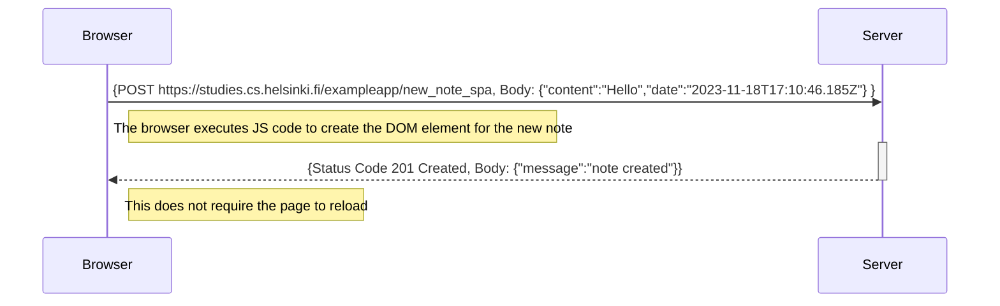

```mermaid
sequenceDiagram

	participant Browser
	participant Server

	Browser->>Server: {POST https://studies.cs.helsinki.fi/exampleapp/new_note_spa, Body: {"content":"Hello","date":"2023-11-18T17:10:46.185Z"} }
	Note right of Browser: The browser executes JS code to create the DOM element for the new note
	activate Server
	Server-->>Browser: {Status Code 201 Created, Body: {"message":"note created"}}
	deactivate Server

	Note right of Browser: This does not require the page to reload
```
